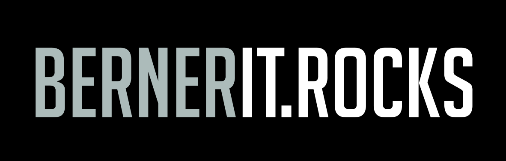

# Willkommen beim Verein *bernerit.rocks*

> Der Verein *bernerit.rocks* verfolgt das Ziel, öffentliche, IT-bezogene, technisch motivierte Events im Raum Bern zu organisieren und durchzuführen.
>
> Der Verein verfolgt ideelle und keine kommerziellen Zwecke und erstrebt keinen
Gewinn. Die Organe sind ehrenamtlich tätig.

## Events

Wir organisieren die [Cloud Native Bern Meetups](https://www.meetup.com/cloudnativebern/).

Am 14. September 2022 findet auf dem Gurten der zweite [Swiss Cloud Native Day](https://cloudnativeday.ch) statt.

## Statuten

Siehe [Statuten](statuten.md)

## Vorstand

* Johann Gyger (Präsident)
* Mathias Herzog (Finanzen, Vizepräsident)
* Philipp Grossenbacher (Aktuariat)

## Revision

* Philipp Grossenbacher

## Kontakt

Wende dich an [info@bernerit.rocks](mailto:info@bernerit.rocks).

## Adresse

Verein bernerit.rocks  
CH-3000 Bern

## Unsere aktuellen Gönner

* Levingo GmbH, Bern
* Puzzle ITC GmbH, Bern
* acend gmbh, Bern

## Werde Gönner

Als Gönner unterstützt du den Verein bernerit.rocks finanziell und hast damit die Chance, gemeinsam mit uns die Berner Community rund um die aktuellsten IT-Themen zu prägen.

Dein Engagement ab 100 CHF als Privat- oder ab 1000 CHF als Geschäftsperson wird auf der Webseite unseres Vereins und bei unseren Meetups publiziert (die Publikation erfolgt aus steuerrechtlichen Gründen ohne Online-Verlinkung).
